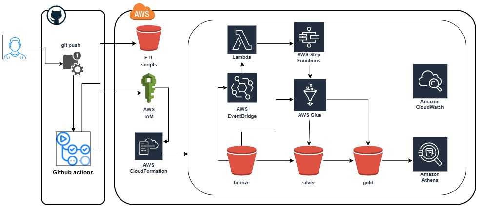

# AWS ETL Pipeline - E-Commerce UK
Pipeline ETL end-to-end en AWS que implementa la Arquitectura Medallón (Bronce → Plata → Oro) para datos de transacciones de comercio electrónico. Orquestación automatizada con EventBridge, Lambda y Step Functions. Procesamiento de datos con AWS Glue y consultas con Athena. Infraestructura como código utilizando CloudFormation.

# Arquitectura AWS ETL e-commerce UK
<br>

## 1. Crear un usuario IAM para GitHub Actions
1. Ve a **IAM Console** → **Users** → **Create user**
2. Nombre: `github-actions-user`
3. Attach policies directly → **Create policy** con el siguiente JSON:

```json
{
    "Version": "2012-10-17",
    "Statement": [
        {
            "Effect": "Allow",
            "Action": [
                "cloudformation:*",
                "s3:*",
                "lambda:*",
                "glue:*",
                "states:*",
                "events:*",
                "iam:PassRole",
                "iam:CreateRole",
                "iam:DeleteRole",
                "iam:AttachRolePolicy",
                "iam:DetachRolePolicy",
                "iam:GetRole",
                "iam:PutRolePolicy",
                "iam:DeleteRolePolicy"
            ],
            "Resource": "*"
        }
    ]
}
```
4. Adjuntar la política al usuario github-actions-user
5. Crear Access Key (tipo: Command Line Interface)
6. Guardar el Access Key ID y Secret Access Key (solo se muestran una vez)

## 2. AWS CLI
1. Instala aws cli https://docs.aws.amazon.com/cli/latest/userguide/getting-started-install.html
2. Verifica la instalación: `aws --version`
3. Configurar: `aws configure`
4. Agregar los valores:
```Markdown
    Access Key ID: "TU_ACCESS_KEY_AQUI"
    Secret Access Key: "TU_SECRET_KEY_AQUI"
    region: us-east-1   (o la que uses)
    output format: json
```
5. Probar conexión: `aws s3 ls`

## 3. Asignar valores en GitHub Actions
1. Ve a tu repositorio en GitHub
2. Settings → Secrets and variables → Actions
3. Agregar los siguientes secrets:

| Secret Name | Value |
|-------------|-------|
| `AWS_ACCESS_KEY_ID` | Access Key ID creado |
| `AWS_SECRET_ACCESS_KEY` | Secret Access Key creado |
| `ARTIFACTS_BUCKET` | Secret Artifact bucket creado |

📌 **Nota:** `ARTIFACTS_BUCKET` es una **variable** que contiene el **nombre** del bucket que crearás en el siguiente paso. El bucket físico aún no existe, solo definimos su nombre.

## 4. Crear bucket de artefactos manualmente
Ahora crea físicamente el bucket usando el nombre que definiste en `ARTIFACTS_BUCKET`:

```Bash
# Definir nombre del bucket (debe coincidir con ARTIFACTS_BUCKET en GitHub)
ARTIFACTS_BUCKET=<NOMBRE_BUCKET_ARTIFACT>

# Crear bucket
aws s3 mb s3://$ARTIFACTS_BUCKET --region us-east-1

aws s3api put-object --bucket $ARTIFACTS_BUCKET --key scripts/
aws s3api put-object --bucket $ARTIFACTS_BUCKET --key lambda/
aws s3api put-object --bucket $ARTIFACTS_BUCKET --key stepfunctions/
```

## 5. Descargar el proyecto
```Bash
git clone https://github.com/jeanavellaneda/aws-etl-ecommerce-uk.git
cd aws-etl-ecommerce-uk
git checkout develop
```

## 6. Desplegar con GitHub Actions
📌 Asegúrate que tu workflow esté configurado para la rama correcta (main o develop), puedes realizar algun cambio para que ejecute el pipeline
```Bash
git add .
git commit -m "Initial commit"
git push origin develop
```

## 7. Subir archivo a Bucket
📌 Nota: Para obtener el nombre del bucket (`<tu-bucket>`).
```Bash
aws cloudformation describe-stacks --stack-name retail-etl-stack-test --query "Stacks[0].Outputs[?OutputKey=='DataLakeBucket'].OutputValue" --output text
```

📌 Nota: 
- Si el archivo tiene espacios en el nombre, usa comillas o renómbralo. Ejemplo: "Online Retail.csv"
- El archivo a subir lo puedes obtener del proyecto /data/Online Retail
```Bash
aws s3 cp "../ruta/Online Retail.csv" "s3://<tu-bucket>/bronze/Online Retail.csv"
```

## 8. Monitorear la ejecución
```SQL
-- Consultar datos en Silver
SELECT * FROM retail_db_test.ecommerce_retail_silver LIMIT 10;

-- Consultar datos en Gold
SELECT * FROM retail_db_test.ecommerce_retail_gold LIMIT 10;
```

## 9. Limpieza de recursos (opcional)
```Bash
# Eliminar stack de CloudFormation
aws cloudformation delete-stack --stack-name retail-etl-stack-test

# Eliminar bucket de artefactos
aws s3 rm s3://ARTIFACTS_BUCKET --recursive
aws s3 rb s3://ARTIFACTS_BUCKET 
```

## 10. 📊 Tecnologías AWS

| Servicio | Uso |
|----------|-----|
| **Amazon S3** | Data Lake (Bronze, Silver, Gold) |
| **EventBridge** | Detección de eventos en S3 |
| **AWS Lambda** | Trigger inicial |
| **Step Functions** | Orquestación de Glue jobs |
| **AWS Glue** | Procesamiento ETL (PySpark) |
| **Athena** | Consultas SQL serverless |
| **CloudFormation** | Infraestructura como código |
| **IAM** | Seguridad y permisos |
| **CloudWatch** | Monitoreo y logs |

## 11. 🛠️ CI/CD y Herramientas

| Herramienta | Uso |
|-------------|-----|
| **GitHub Actions** | Pipeline de despliegue automatizado |
| **Git** | Control de versiones |
| **AWS CLI** | Interacción con AWS |